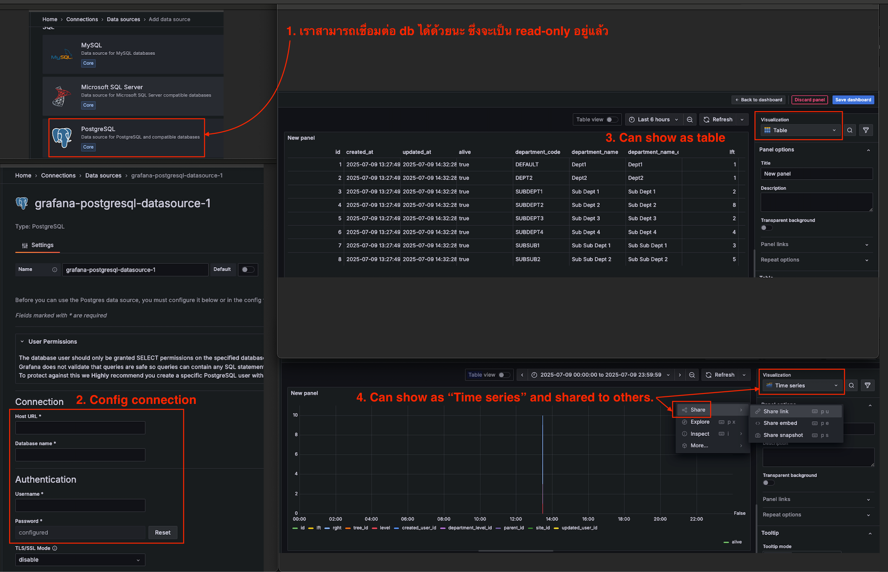

# บทนำสู่ Grafana และ Prometheus


## Grafana และ Prometheus คืออะไร?

คุณเคยสงสัยไหมว่ามีอะไรเกิดขึ้นภายในคอมพิวเตอร์หรือเซิร์ฟเวอร์ของคุณ? มีการใช้หน่วยความจำมากแค่ไหน? CPU ทำงานหนักเกินไปหรือไม่? มีปัญหาอะไรที่คุณควรรู้หรือไม่?

นี่คือจุดที่ Grafana และ Prometheus เข้ามาช่วย พวกมันเป็นเหมือนเครื่องมือพิเศษที่ช่วยให้คุณเห็นสิ่งที่เกิดขึ้นภายในระบบคอมพิวเตอร์ของคุณ คิดถึงพวกมันเหมือนกับแผงหน้าปัดรถยนต์ที่แสดงความเร็ว ระดับน้ำมัน และอุณหภูมิเครื่องยนต์ - แต่สำหรับระบบคอมพิวเตอร์ของคุณ!

## เรื่องราวของ Prometheus: ผู้เก็บข้อมูล

Prometheus ตั้งชื่อตามไททันในเทพปกรณัมกรีกผู้มอบไฟให้มนุษยชาติ เช่นเดียวกับที่ไททันนำแสงสว่างมาให้ Prometheus นำความชัดเจนมาสู่ระบบของคุณ

Prometheus เป็นผู้เก็บรวบรวมข้อมูล งานของมันเรียบง่ายแต่สำคัญ: มันตรวจสอบระบบของคุณเป็นประจำและเก็บตัวเลขเกี่ยวกับสถานะการทำงาน ตัวเลขเหล่านี้ (เรียกว่าเมตริก) อาจเป็น:
- มีการใช้หน่วยความจำมากแค่ไหน
- CPU ทำงานหนักแค่ไหน
- เหลือพื้นที่ดิสก์อีกเท่าไร
- มีคนใช้เว็บไซต์ของคุณกี่คน

Prometheus ไม่ได้เก็บข้อมูลนี้เพียงครั้งเดียว - มันเก็บข้อมูลซ้ำแล้วซ้ำเล่า (ทุก 5 วินาทีในการตั้งค่าของเรา) และเก็บประวัติไว้ ด้วยวิธีนี้ คุณจึงเห็นไม่เพียงแค่ว่าระบบของคุณทำงานอย่างไรในตอนนี้ แต่ยังรวมถึงว่ามันทำงานอย่างไรเมื่อชั่วโมงที่แล้ว เมื่อวานนี้ หรือสัปดาห์ที่แล้ว

ในการตั้งค่าของเรา Prometheus ทำงานในคอนเทนเนอร์ของตัวเองและถูกกำหนดค่าผ่านไฟล์ง่ายๆ ที่เรียกว่า `prometheus.yml` ไฟล์นี้บอก Prometheus ว่าจะเก็บอะไรและบ่อยแค่ไหน

```yaml
global:
  scrape_interval: 5s

scrape_configs:
  - job_name: 'node'
    static_configs:
      - targets: ['node-exporter:9100']
```

การกำหนดค่านี้บอก Prometheus ให้เก็บข้อมูลทุก 5 วินาทีจากสิ่งที่เรียกว่า "node-exporter" - ซึ่งนำเราไปสู่คอมโพเนนต์ถัดไป

## เรื่องราวของ Node Exporter: ผู้รายงาน

ในขณะที่ Prometheus เก่งในการเก็บข้อมูล แต่มันต้องการบางสิ่งที่บอกว่ากำลังเกิดอะไรขึ้นบนคอมพิวเตอร์ของคุณ นี่คือจุดที่ Node Exporter เข้ามา

Node Exporter เป็นเหมือนนักข่าว งานของมันคือดูระบบคอมพิวเตอร์ของคุณ รวบรวมข้อมูลเกี่ยวกับมัน และทำให้ข้อมูลนี้พร้อมใช้งานสำหรับ Prometheus ในการเก็บรวบรวม

Node Exporter สามารถรายงานเกี่ยวกับหลายด้านของระบบของคุณ:
- การใช้งาน CPU
- การใช้หน่วยความจำ
- พื้นที่ดิสก์
- การจราจรเครือข่าย
- และอื่นๆ อีกมากมาย

ในการตั้งค่าของเรา Node Exporter ทำงานในคอนเทนเนอร์ของตัวเองและทำให้ข้อมูลทั้งหมดนี้พร้อมใช้งานบนพอร์ต 9100 Prometheus รู้ว่าต้องมองที่นี่เพื่อเก็บข้อมูล

## เรื่องราวของ Grafana: ผู้เล่าเรื่อง

ตอนนี้เรามี Prometheus ที่เก็บตัวเลขมากมายจาก Node Exporter แต่การดูตัวเลขดิบไม่ค่อยมีประโยชน์สำหรับคนส่วนใหญ่ นี่คือจุดที่ Grafana เข้ามา

Grafana เป็นผู้เล่าเรื่อง มันนำตัวเลขทั้งหมดที่ Prometheus เก็บรวบรวมและเปลี่ยนเป็นแผนภูมิและกราฟที่สวยงามและเข้าใจง่าย แทนที่จะดูตัวเลขดิบ คุณสามารถเห็นเส้นที่มีสีสันแสดงว่าการใช้งาน CPU ของคุณเปลี่ยนไปอย่างไรตามเวลา หรือมีการใช้หน่วยความจำมากแค่ไหน

Grafana ช่วยให้คุณสร้างแดชบอร์ด - คอลเลกชันของแผนภูมิและกราฟเหล่านี้ที่ให้ภาพรวมของสุขภาพระบบของคุณในทันที

ในการตั้งค่าของเรา Grafana ทำงานในคอนเทนเนอร์ของตัวเองและถูกกำหนดค่าให้อนุญาตให้ทุกคนดูแดชบอร์ดโดยไม่ต้องเข้าสู่ระบบ (แม้ว่าในสถานการณ์จริง คุณอาจต้องการเพิ่มการป้องกันด้วยรหัสผ่าน)

## วิธีที่ทั้งหมดทำงานร่วมกัน

ความสวยงามของระบบนี้คือวิธีที่คอมโพเนนต์ทั้งสามทำงานร่วมกัน:

1. **Node Exporter** ตรวจสอบระบบของคุณและเตรียมรายงานเกี่ยวกับสุขภาพของมัน
2. **Prometheus** เก็บรวบรวมรายงานเหล่านี้เป็นประจำและเก็บไว้ในฐานข้อมูลอนุกรมเวลา
3. **Grafana** เชื่อมต่อกับ Prometheus รับข้อมูล และเปลี่ยนเป็นการแสดงผลที่สวยงาม

มันเหมือนทีมที่ประสานงานกันอย่างดี:
- Node Exporter เป็นผู้สื่อข่าวภาคสนามที่รวบรวมข้อเท็จจริง
- Prometheus เป็นบรรณาธิการที่เก็บรวบรวมและจัดระเบียบรายงานทั้งหมด
- Grafana เป็นหนังสือพิมพ์ที่นำเสนอข้อมูลในรูปแบบที่ทุกคนเข้าใจได้ง่าย

## การตั้งค่าระบบมอนิเตอร์ของคุณเอง

สิ่งที่ดีเกี่ยวกับการตั้งค่านี้คือทั้งหมดถูกบรรจุอย่างเรียบร้อยโดยใช้ Docker Compose ด้วยไฟล์เพียงไม่กี่ไฟล์ คุณสามารถมีระบบมอนิเตอร์ที่สมบูรณ์พร้อมใช้งาน

นี่คือไฟล์ `docker-compose.yml` ที่กำหนดบริการทั้งสาม:

```yaml
version: '3'

services:
  prometheus:
    image: prom/prometheus
    volumes:
      - ./prometheus.yml:/etc/prometheus/prometheus.yml
    ports:
      - "9090:9090"

  node-exporter:
    image: prom/node-exporter
    ports:
      - "9100:9100"

  grafana:
    image: grafana/grafana
    ports:
      - "3000:3000"
    volumes:
      - grafana-storage:/var/lib/grafana
    environment:
      - GF_AUTH_ANONYMOUS_ENABLED=true
      - GF_AUTH_ANONYMOUS_ORG_ROLE=Viewer

volumes:
  grafana-storage:
```

ไฟล์นี้บอก Docker ให้:
1. เริ่มคอนเทนเนอร์ Prometheus พร้อมการกำหนดค่าของคุณ
2. เริ่มคอนเทนเนอร์ Node Exporter เพื่อเก็บเมตริกของระบบ
3. เริ่มคอนเทนเนอร์ Grafana โดยเปิดใช้งานการเข้าถึงแบบไม่ระบุตัวตน
4. สร้างโวลุ่มถาวรสำหรับ Grafana เพื่อให้แดชบอร์ดของคุณไม่หายไปเมื่อคุณรีสตาร์ท

ในการเริ่มระบบทั้งหมด คุณเพียงแค่ต้องรัน:

```bash
docker-compose up -d
```

หลังจากนั้น คุณสามารถเข้าถึง:
- Prometheus ที่ http://localhost:9090
- เมตริกของ Node Exporter ที่ http://localhost:9100/metrics
- Grafana ที่ http://localhost:3000

## การสร้างแดชบอร์ดแรกของคุณ

เมื่อทุกอย่างทำงานแล้ว คุณสามารถสร้างแดชบอร์ดแรกของคุณใน Grafana:

1. เปิด Grafana ที่ http://localhost:3000
2. เพิ่ม Prometheus เป็นแหล่งข้อมูล:
   - ไปที่ Configuration > Data Sources
   - เพิ่มแหล่งข้อมูลใหม่
   - เลือก Prometheus
   - ตั้งค่า URL เป็น http://prometheus:9090
   - คลิก "Save & Test"
3. นำเข้าแดชบอร์ดที่สร้างไว้แล้ว:
   - ไปที่ Create > Import
   - ป้อน ID แดชบอร์ด 1860 (แดชบอร์ด Node Exporter ยอดนิยม)
   - เลือกแหล่งข้อมูล Prometheus ของคุณ
   - คลิก "Import"

และแค่นั้น คุณจะมีแดชบอร์ดที่สวยงามแสดงข้อมูลทุกประเภทเกี่ยวกับระบบของคุณ!



## ทำไมสิ่งนี้จึงสำคัญ

ในโลกปัจจุบัน คอมพิวเตอร์ทำงานทุกอย่างตั้งแต่เว็บไซต์เล็กๆ ไปจนถึงบริการขนาดใหญ่ที่มีผู้ใช้หลายล้านคน การรู้ว่ากำลังเกิดอะไรขึ้นภายในระบบเหล่านี้ไม่ใช่แค่น่าสนใจ - แต่จำเป็น

ด้วย Grafana และ Prometheus คุณสามารถ:
- พบปัญหาก่อนที่จะกลายเป็นเรื่องร้ายแรง
- เข้าใจว่าระบบของคุณทำงานอย่างไรตลอดเวลา
- ตัดสินใจได้ดีขึ้นว่าเมื่อไหร่ควรอัปเกรดฮาร์ดแวร์
- รู้ทันทีเมื่อมีบางอย่างผิดปกติ

ไม่ว่าคุณจะกำลังดูแลบล็อกส่วนตัวหรือบริการเว็บขนาดใหญ่ การมองเห็นภายในระบบของคุณช่วยให้คุณสบายใจและช่วยให้คุณมอบประสบการณ์ที่ดีขึ้นสำหรับผู้ใช้ของคุณ

## บทสรุป

Grafana และ Prometheus พร้อมด้วย Node Exporter รวมกันเป็นสามเครื่องมือที่ทรงพลังสำหรับการมอนิเตอร์ระบบของคุณ พวกมันเป็นโอเพนซอร์ส ค่อนข้างง่ายในการตั้งค่า (โดยเฉพาะอย่างยิ่งด้วย Docker) และให้ข้อมูลเชิงลึกที่มีค่าเกี่ยวกับระบบคอมพิวเตอร์ของคุณ

ครั้งต่อไปที่คุณสงสัยว่า "กำลังเกิดอะไรขึ้นภายในเซิร์ฟเวอร์ของฉัน?" หรือ "ทำไมเว็บไซต์ของฉันจึงช้า?" จำไว้ว่าเครื่องมือเหล่านี้สามารถช่วยคุณหาคำตอบได้ พวกมันเปลี่ยนโลกที่มองไม่เห็นภายในคอมพิวเตอร์ของคุณให้เป็นข้อมูลที่มองเห็นได้และนำไปปฏิบัติได้

มอนิเตอร์อย่างมีความสุข!
