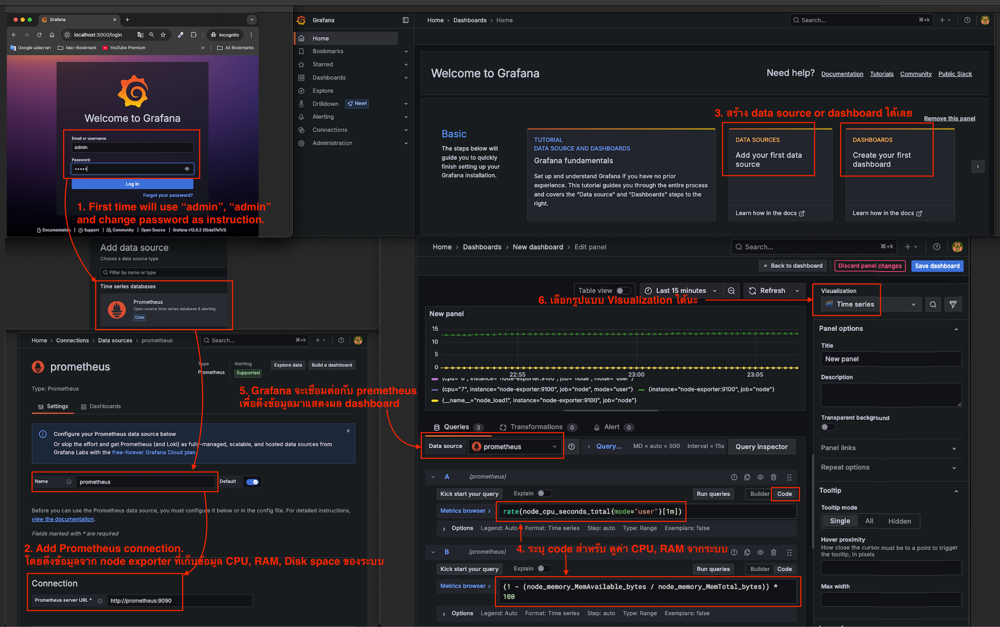
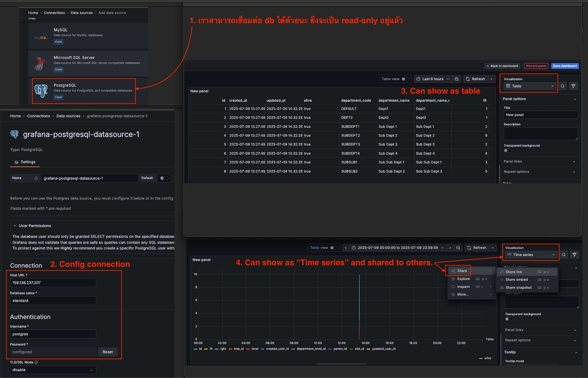

# Prometheus and Grafana Monitoring System

This project sets up a complete monitoring system using Prometheus and Grafana with Docker Compose.

Path in Mac: `/Users/atthana/Desktop/Private_Q/Trainings/27_DevOps/grafana`

## Overview

This monitoring stack consists of three main components:

1. **Prometheus** - Collects and stores metrics
2. **Node Exporter** - Gathers system metrics from the host
3. **Grafana** - Visualizes the metrics in beautiful dashboards

## Components Explained

### Prometheus

Prometheus is an open-source monitoring and alerting system. It:
- Collects metrics from configured targets at regular intervals
- Stores all collected metrics in a time-series database
- Provides a query language (PromQL) to analyze the data
- Runs on port 9090

In our setup, Prometheus is configured to:
- Scrape metrics every 5 seconds
- Collect data from Node Exporter
- Use a custom configuration file (prometheus.yml)

### Node Exporter

Node Exporter is a Prometheus exporter that:
- Collects hardware and OS metrics from the host system
- Exposes system metrics like CPU usage, memory, disk space, and network statistics
- Makes these metrics available for Prometheus to scrape
- Runs on port 9100

### Grafana

Grafana is a visualization and analytics platform that:
- Creates beautiful dashboards from your metrics data
- Connects to Prometheus as a data source
- Allows you to create alerts based on your metrics
- Provides a user-friendly web interface
- Runs on port 3000

In our setup, Grafana is configured with:
- Anonymous access enabled (no login required)
- Anonymous users have Viewer permissions
- Persistent storage for dashboards and settings

## Configuration Files

### docker-compose.yml

This file defines all three services and their configurations:
- Sets up the container images
- Maps the necessary ports
- Connects volumes for data persistence
- Sets environment variables for Grafana

### prometheus.yml

This file configures Prometheus:
- Sets the global scrape interval to 5 seconds
- Configures Prometheus to collect metrics from Node Exporter

## How to Use

### Starting the System

```bash
docker-compose up -d
```

This command starts all three services in detached mode.

### Accessing the Services

- **Prometheus**: http://localhost:9090
- **Node Exporter Metrics**: http://localhost:9100/metrics
- **Grafana**: http://localhost:3000

### Setting Up Grafana

1. Open Grafana at http://localhost:3000
2. Add Prometheus as a data source:
   - Go to Configuration > Data Sources
   - Add a new data source
   - Select Prometheus
   - Set the URL to http://prometheus:9090
   - Click "Save & Test"
3. Import dashboards:
   - Go to Create > Import
   - Enter dashboard ID 1860 for Node Exporter Full dashboard
   - Select your Prometheus data source
   - Click "Import"

## How It All Works Together

1. **Node Exporter** collects system metrics from your host machine
2. **Prometheus** scrapes these metrics from Node Exporter at regular intervals
3. **Grafana** connects to Prometheus and visualizes the data in dashboards

This creates a complete monitoring pipeline from data collection to visualization.

## Customization

- To monitor additional targets, add them to the `prometheus.yml` file
- To add more dashboards in Grafana, import them from the Grafana dashboard library
- To enable alerts, configure them in Grafana or Prometheus

## Persistent Data

The setup includes a named volume (`grafana-storage`) to ensure your Grafana dashboards and settings are preserved between restarts.


---




